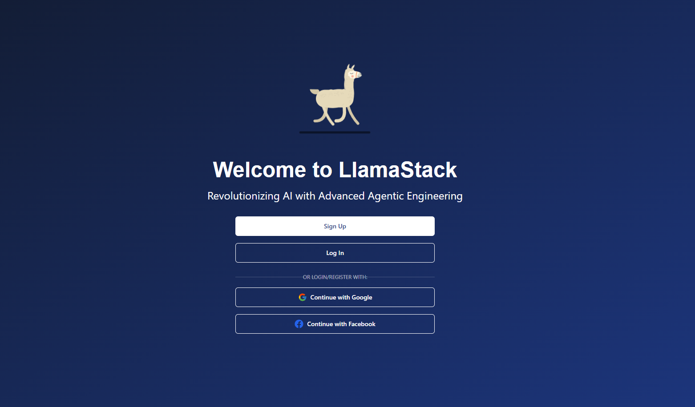

# LlamaStack

[](https://llamastack.ruv.io/?login=demo)

LlamaStack is a cutting-edge AI platform developed by rUv and built on Llama Stack Apps by Meta, offering a comprehensive ecosystem for building and deploying sophisticated AI applications using Llama 3.1 models. It features advanced language models available in 8B, 70B, and 405B parameter versions, supporting multiple languages and boasting a 128K token context length.

The platform includes a standardized API, safety mechanisms like Llama Guard 3 and Prompt Guard, and powerful agentic capabilities for multi-step reasoning and autonomous decision-making.

With support for customization, tool use, and zero-shot learning, LlamaStack enables developers to create a wide range of applications, from intelligent chatbots and workflow assistants to coding aids and database interaction tools. By providing open-source implementations and encouraging community engagement, Meta aims to foster innovation while promoting responsible AI development.

Llama Stack UI created by rUv.

## Demo Site
https://llamastack.ruv.io/?login=demo
user = test@test.com 
pass = password

## Key Features

LlamaStack is a comprehensive AI platform developed by rUv, designed to facilitate the creation and deployment of sophisticated AI applications using **Llama 3.1** models. 

Here's an overview of its key features:

---

### 🌟 **Advanced Language Models:**

- Available in **8B**, **70B**, and **405B** parameter versions
- Support for **multiple languages**
- **128K** token context length for handling complex tasks

---

### 🤖 **Agentic Capabilities:**

- Multi-step reasoning
- Autonomous decision-making
- Customizable agent creation and management

---

### 🔌 **API and Integration:**

- Standardized API for easy integration
- Support for custom tools and extensions
- **Batch processing** capabilities

---

### 🔐 **Safety Mechanisms:**

- **Llama Guard 3** for enhanced security
- **Prompt Guard** to ensure safe and appropriate responses

---

### 🛠️ **Development Tools:**

- AI-powered code analysis and suggestions
- Real-time collaboration features
- Integrated development environment

---

### 📊 **Analytics and Monitoring:**

- Performance metrics and visualizations
- Request volume trends
- Error rate analysis and anomaly detection

---

### ⚙️ **Automation:**

- Workflow designer for creating complex automation processes
- Support for various trigger types and action nodes
- Data flow connectors for integrating with external systems

---

### 🧩 **Customization and Flexibility:**

- Support for **zero-shot learning**
- Ability to create custom dashboards and alerts
- Extensible architecture for adding new features and integrations

---

### 🔒 **Security and Access Control:**

- User role management
- API key management
- Audit logs for tracking system activities

---

### 🚀 **Resource Optimization:**

- Automatic scaling suggestions
- Cost analysis and projection tools
- Performance optimization recommendations

---

### 📚 **Documentation and Support:**

- Comprehensive documentation for developers
- Step-by-step guides for getting started
- Community engagement for knowledge sharing

---

### 🎯 **Platform Vision**

LlamaStack aims to provide a powerful, flexible, and user-friendly platform for developers to create a wide range of AI applications, from intelligent chatbots and workflow assistants to coding aids and database interaction tools. 

By offering **open-source implementations** and encouraging community involvement, Meta fosters innovation while promoting **responsible AI development**.

This system is designed to cater to both **beginners** and **advanced users**, offering a scalable solution for various AI application needs across industries.

## Setup

1. Clone the repository
2. Install dependencies:
   ```
   npm install
   ```
3. Start the development server:
   ```
   npm run dev
   ```

### Environment Variables

Create a `.env` file in the root directory with the following variables:

```
VITE_SUPABASE_PROJECT_URL=your_supabase_project_url
VITE_SUPABASE_API_KEY=your_supabase_api_key
```

Replace `your_supabase_project_url` and `your_supabase_api_key` with your actual Supabase project URL and API key.

### Supabase Setup

1. Create a new Supabase project.
2. Run the SQL script in `./sql/init.sql` in your Supabase SQL editor to set up the necessary tables, views, and functions.

## API Endpoints

- GET `/`: Chat moderation with Llama Guard
- GET `/custom-tools`: Chat with custom tools
- GET `/main`: Main chat interface
- POST `/inference/batch_chat_completion`: Batch chat completion
- POST `/inference/batch_completion`: Batch text completion
- POST `/inference/chat_completion`: Single chat completion
- POST `/inference/completion`: Single text completion
- POST `/safety/run_shields`: Run safety shields
- POST `/agentic_system/memory_bank/attach`: Attach memory bank
- POST `/agentic_system/create`: Create agentic system
- POST `/agentic_system/session/create`: Create session
- POST `/agentic_system/turn/create`: Create turn
- POST `/agentic_system/delete`: Delete agentic system
- POST `/agentic_system/session/delete`: Delete session
- POST `/agentic_system/memory_bank/detach`: Detach memory bank
- POST `/agentic_system/session/get`: Get session details
- POST `/agentic_system/step/get`: Get step details
- POST `/agentic_system/turn/get`: Get turn details

For detailed API documentation, visit `http://0.0.0.0:8000/docs` after starting the server.

## Technology Stack

- Frontend: React.js with Vite
- Backend: Supabase (PostgreSQL database and authentication)
- Styling: Tailwind CSS
- State Management: React Query
- Routing: React Router

## Contributing

Please read [CONTRIBUTING.md](CONTRIBUTING.md) for details on our code of conduct, and the process for submitting pull requests.

## License

This project is licensed under the MIT License - see the [LICENSE.md](LICENSE.md) file for details.
